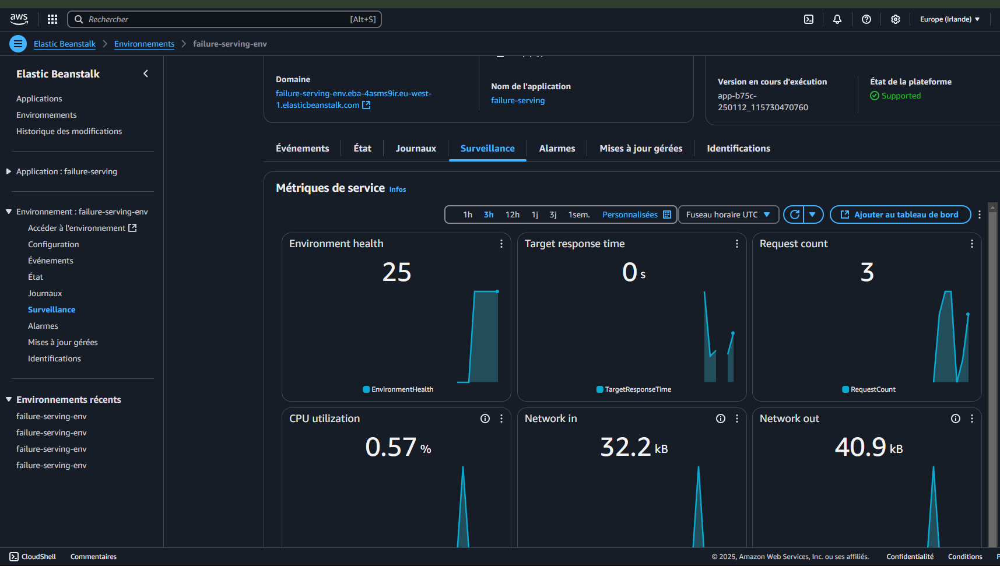

# PredictaMaint

**ML-Powered Predictive Maintenance Platform**

PredictaMaint is an end-to-end machine learning system that forecasts industrial equipment failures before they occur. By analyzing real-time sensor data—including pressure, temperature, rotational speed, vibration, and humidity—the platform identifies early warning patterns and predicts whether equipment is likely to fail. The solution is deployed as a production-ready REST API, enabling seamless integration with existing monitoring dashboards and IoT pipelines. Built with XGBoost, Flask, and Docker, it supports both local deployment and cloud scaling on AWS Elastic Beanstalk.

---

## Academic Information

| | |
|---|---|
| **Institution** | Indian Institute of Technology Jodhpur (IIT Jodhpur) |
| **Project Type** | College / Academic Project |
| **Guided By** | **Dr. Yashaswi Verma** and **Dr. Richa Singh** |

PredictaMaint was developed at IIT Jodhpur under the guidance of Dr. Yashaswi Verma and Dr. Richa Singh. It focuses on predicting industrial equipment failures using machine learning and deploying the solution as a web service for use in predictive maintenance.

---

## Quick Start (Run the Project)

**Option A – One-command setup (recommended)**  
From the project root:

```bash
# macOS: install OpenMP first (required for XGBoost)
brew install libomp

# Create venv, install deps, and start the prediction server
./setup_and_run.sh run
```

In another terminal, test the API:

```bash
source .venv/bin/activate   # or: .venv\Scripts\activate on Windows
python predict-test.py local
```

**Option B – Manual setup with pip**

```bash
python3 -m venv .venv
source .venv/bin/activate
pip install -r requirements.txt
# Optional: (re)train the model
python train.py
# Start the server
python predict.py
```

**Option C – Pipenv (original)**

```bash
pipenv install
pipenv shell
python predict.py
```

---

## Table of Contents

1. [Problem Description](#problem-description)
2. [Data Processing](#data-processing)
3. [Model Training](#model-training)
4. [Deployment](#deployment)
5. [Testing the Service](#testing-the-service)
6. [Dependencies and Environment Setup](#dependencies-and-environment-setup)
7. [Containerization](#containerization)
8. [Cloud Deployment](#cloud-deployment)
9. [Options for Reproducers](#options-for-reproducers)
10. [Illustrated Steps for AWS Elastic Beanstalk Deployment](#illustrated-steps-for-aws-elastic-beanstalk-deployment)
11. [Acknowledgments](#acknowledgments)

---

## Problem Description

This project addresses **predictive maintenance** in industrial settings by using machine learning to predict equipment failures from sensor data. The goal is to:

- Identify patterns that precede failures using historical sensor readings.
- Deploy a reliable prediction service that can be integrated into monitoring systems.

The solution combines exploratory data analysis, feature engineering, model training (including ensemble methods), and deployment as a REST API.

---

## Data Processing

- **Exploratory Data Analysis (EDA)** to understand distributions, missing values, and relationships among features.
- **Feature importance analysis** to select and interpret the most predictive variables.
- **Data preprocessing pipeline** using **one-hot encoding** for categorical variables.

The dataset includes:

- **Features**: Sensor measurements such as pressure, temperature, rotational speed, vibration, humidity, equipment type, and location.
- **Target**: A binary variable indicating whether an equipment failure occurred or not.

---

## Model Training

The following models were evaluated:

- **Logistic Regression** (baseline).
- **Decision Trees**.
- **Ensemble models**: Random Forest and **XGBoost** (selected for deployment).

The best-performing model is saved and used by the prediction service.

---

## Deployment

The chosen model is deployed using **Flask**, which exposes a REST API to submit equipment features and receive failure predictions.

### Testing the Service

1. **Clone this repository:**
   ```bash
   git clone https://github.com/YOUR_USERNAME/Industrial-Equipment-Failure-Prediction.git
   cd Industrial-Equipment-Failure-Prediction
   ```

2. **Install dependencies** (e.g. with Pipenv):
   ```bash
   pipenv install
   pipenv shell
   ```

3. **Run the Flask service:**
   ```bash
   python predict.py
   ```

4. **Send a POST request** to the `/predict` endpoint with a JSON payload containing equipment features:
   - For **local** testing:
     ```bash
     python predict-test.py local
     ```
   - For testing with a **deployed AWS environment**:
     ```bash
     python predict-test.py
     ```

**Recommendation:** Run the test script multiple times, as equipment and features are chosen randomly. This helps observe both outcome classes (failure and no failure).

---

## Dependencies and Environment Setup

- Use **Pipenv** to manage the environment:
  ```bash
  pipenv install
  pipenv shell
  ```

- **Key files:**
  - `Pipfile`: Dependency list.
  - `requirements.txt`: Alternative pip-based dependency list.
  - `Dockerfile`: For containerized deployment.

---

## Containerization

A **Docker** image is provided for easier deployment. Build and run:

```bash
docker build -t equipment-failure .
docker run -it --rm -p 9696:9696 equipment-failure
```

---

## Cloud Deployment

The service can be deployed on **AWS Elastic Beanstalk** and tested with:

```bash
python predict-test.py
```

### Options for Reproducers

To reproduce or test the deployment:

1. Create your own **AWS Elastic Beanstalk** environment using the provided configuration and deployment scripts.
2. Alternatively, deploy locally using Docker or the Flask server and use `python predict-test.py local`.

### Illustrated Steps for AWS Elastic Beanstalk Deployment

1. **Elastic Beanstalk local deployment**
   - EB init & local run:
   ```bash
   eb init -p "Docker running on 64bit Amazon Linux 2023" failure-serving -r eu-west-1
   eb local run --port 9696
   ```
   - EB local listening  

2. **Elastic Beanstalk cloud deployment**
   - EB create cloud environment:
   ```bash
   eb create failure-serving-env --enable-spot
   ```
   - EB cloud environment monitoring  
   

3. **Local & cloud testing**
   - Local testing:
   ```bash
   python predict-test.py local
   ```
   - Cloud AWS EB testing:
   ```bash
   python predict-test.py
   ```
   - EB cloud environment termination:
   ```bash
   eb terminate failure-serving-env
   ```

---


## Acknowledgments

This project was completed at **Indian Institute of Technology Jodhpur (IIT Jodhpur)**. We thank **Dr. Yashaswi Verma** and **Dr. Richa Singh** for their guidance, feedback, and support throughout the project.

